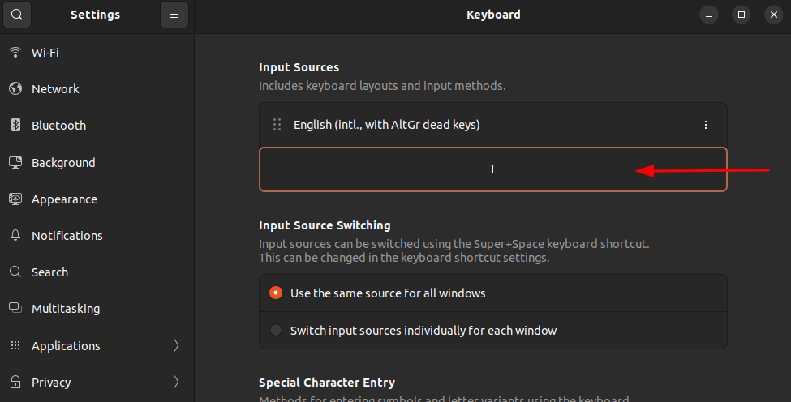
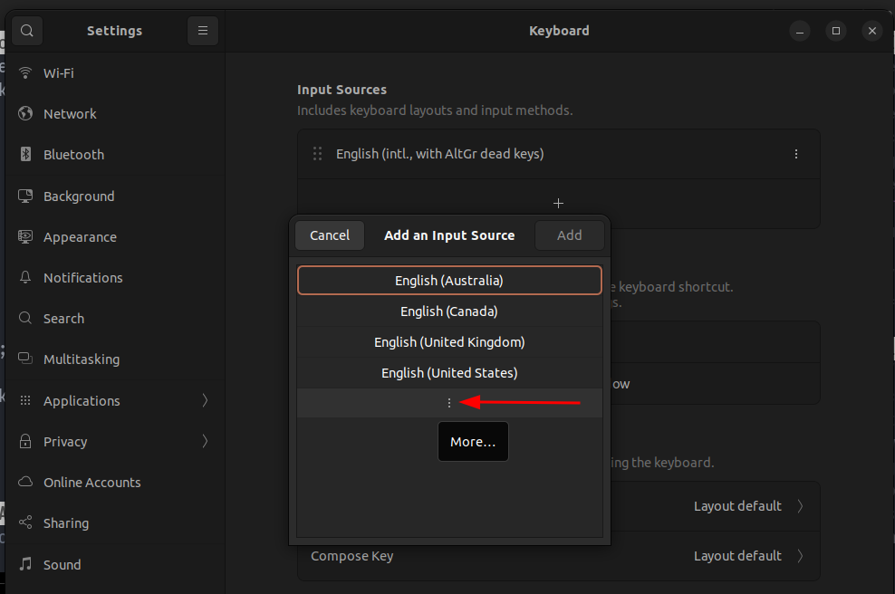
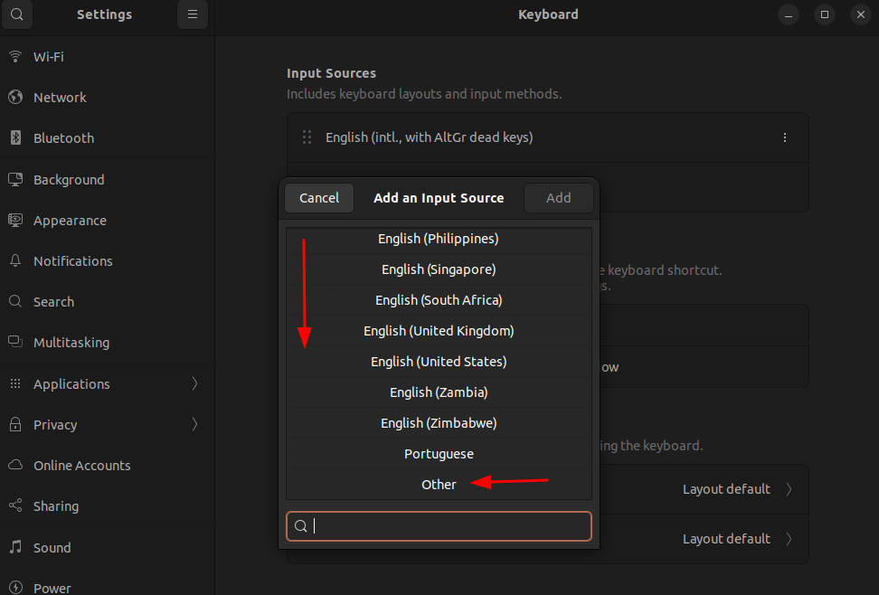
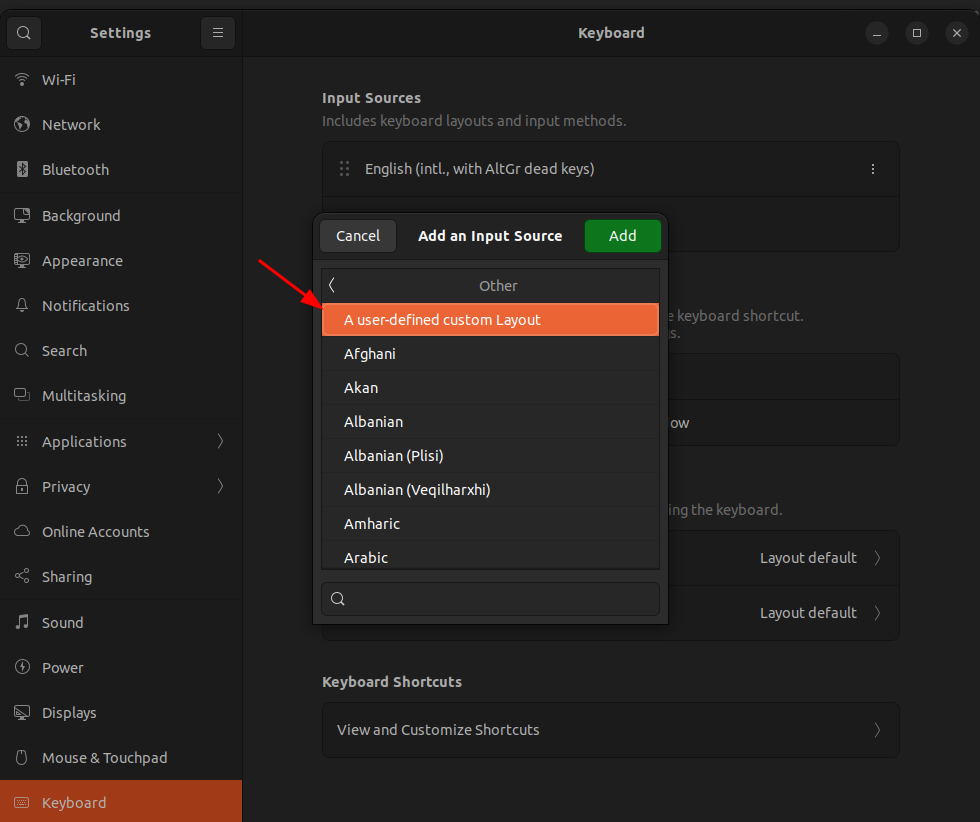
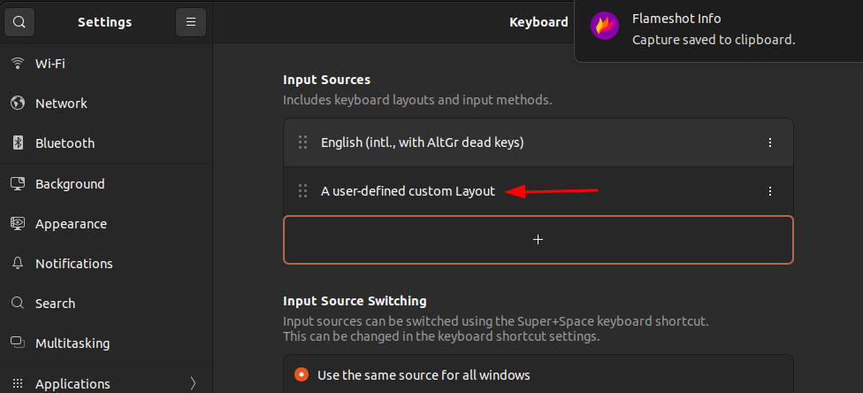
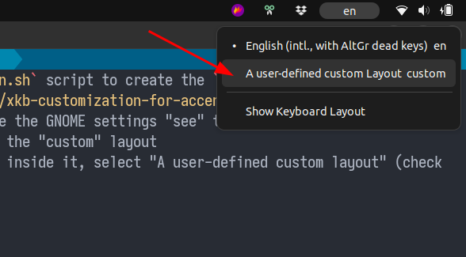
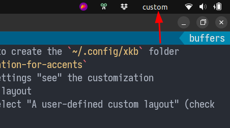

2023-07-27:
==========

Configuring Ubuntu 22.04.2 LTS (Jammy) I noticed the old way of setting the layout with xkbcomp (check the `amalbuquerque/dotfiles/lxlayout.sh`) doesn't work with GNOME on Wayland.

To get the custom layout in place we should:

- Use the GNOME settings to select the "English (intl., with AltGr dead keys)" as the only keyboard layout
- Use the `create_xkb_customization.sh` script to create the `~/.config/xkb` folder structure and symlink the `symbols/xkb-customization-for-accents`
- Log off and login again to ensure the GNOME settings "see" the customization
- Use the GNOME settings to select the "custom" layout
    * You need to pick "Other" and inside it, select "A user-defined custom layout" (check the pictures below)

    
    
    
    
    

- Select the custom layout

    
    

2019/02/28:
===========

To install and use the keymap every time, clone this repo and then run the `load_xkb_keymap_on_xinitrc.sh` script.

It will add a line to the `~/.xinitrc` file that will load the current keymap with `xkbcomp`.

UPDATE 2017/11/26:
==================

- `xcape` wasn't working that well (while writing fast, space would activate the Fn-layer instead of just sending Space);
- Tried a `spacefn.cpp` program from `Pro XKB`, a fellow Geekhack user sent me after reading his inputs about the topic, and it worked flawlessly! It needed a layout with Level 5, therefore I exported the German Neo layout (https://neo-layout.org/index_en.html) that had the needed Level 5 and started plugging my own layout on top of it (ANSI-US with some tweaks for having common portuguese accents+characters and also my long-wished-for SpaceFn).
- To compile `spacefn.cpp`, use the Dockerfile to run a container with the needed dependencies and follow the comments on the source file.
- Then to use it:
  1. Apply the `neo_lx` layout (adjust the paths): `xkbcomp -I$HOME/projs/personal/xkb_spike ~/projs/personal/xkb_spike/neo_map :0`
  2. Run the `spacefn` after mapping `space` to the unused keycode: `xmodmap -e "keycode 202 = space" -e "keycode 65 =" ; ~/projs/personal/spacefn_xkb/spacefn &`

NOTES
=====

`my.xkb` is the full "dumped" xkb configuration with:

 - xkbcomp :0 my.xkb (:0 is the X $DISPLAY)

 To apply it (after changing it):

 - xkbcomp my.xkb :0

 This is ugly since we have the whole dump of the configuration. Read here (https://a3nm.net/blog/xkbcomp.html) that we can just have the changes we made to a specific and existing layout.

First created the `my_map` with:

 - setxkbmap -layout us -variant altgr-intl -model pc104 -option caps:ctrl_modifier -print > my_map

Then created the `symbols` folder and the `accents` config file (it can have any name) and added my changes to it (to have immediate backtick, tilde and circumflex on AltGr+T|G|B, respectively).

Finally, added the `+accents(accents)` to the `xkb_symbols` entry on the `my_map` file.

To apply it use:

 - xkbcomp -I$HOME/xkb_spike ~/xkb_spike/my_map :0 (:0 is the X $DISPLAY)

To reset the keyboard layout:

 - setxkbmap -layout us -variant altgr-intl -model pc104 -option caps:ctrl_modifier

USEFUL RESOURCES
----------------

 - From where I took the approach of only customizing a subset of stuff: https://a3nm.net/blog/xkbcomp.html
 - Unix Stackexchange question about how to assign a new shift level to Fn1-12, placed me in the right HYPER direction: https://unix.stackexchange.com/questions/155797/xkb-assign-a-new-shift-level-to-function-keys
 - Cool Medium article: https://medium.com/@damko/a-simple-humble-but-comprehensive-guide-to-xkb-for-linux-6f1ad5e13450
 - How to create a custom selectable layout blog post: http://rlog.rgtti.com/2014/05/01/how-to-modify-a-keyboard-layout-in-linux/
 - An article that goes to great detail to explain how xkb works: https://www.charvolant.org/doug/xkb/html/node5.html
 - Arch linux comprehensive documentation on xkb: https://wiki.archlinux.org/index.php/X_KeyBoard_extension

RUNNING XCAPE TO ACHIEVE SPACEFN
--------------------------------

Running xcape with the following allows me to use Space as Hyper (if the Space physical key is sending the Hyper):
 - xcape -f -t 140 -e 'Hyper_R=space;Shift_L=Escape;Shift_R=Delete'
 - After trial and error, 140 feels like the appropriate timeout

PROBLEMS
--------

1. Apparently, some of the SpaceFN mappings don't work inside Alacritty :(
    * arrows, home, end don't work
    * backspace, delete work
2. XF86Audio\* keycodes are sent but don't do a thing
